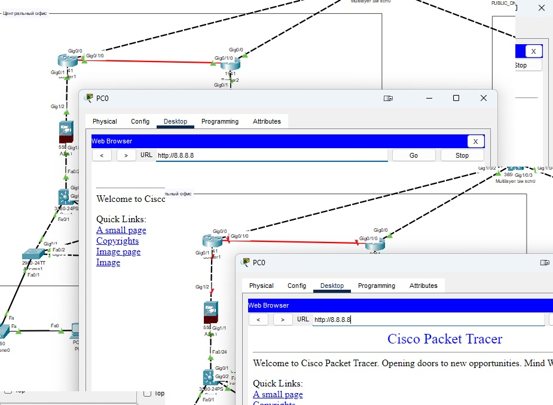

# Дипломная работа по курсу «Сетевой инженер»

## Студент: Межибо Евгений

- [Дипломная работа по курсу «Сетевой инженер»](#дипломная-работа-по-курсу-сетевой-инженер)
  - [Студент: Межибо Евгений](#студент-межибо-евгений)
    - [Цель дипломной работы](#цель-дипломной-работы)
    - [Чек-лист готовности к выполнению дипломной работы](#чек-лист-готовности-к-выполнению-дипломной-работы)
    - [Инструменты и дополнительные материалы, используемые в работе](#инструменты-и-дополнительные-материалы-используемые-в-работе)
  - [Выполнение задание](#выполнение-задание)
    - [Этапы выполнения](#этапы-выполнения)
    - [Тестирование](#тестирование)
    - [Правила приема дипломной работы](#правила-приема-дипломной-работы)


### Цель дипломной работы
 

Построение хорошо масштабируемой отказоустойчивой и защищённой сети, выделяя для каждого пользовательского сервиса уникальные права и пропускную полосу. Объединение разрозненных филиальных сетий компании в одну единую. Настройка централизованной аутентификации и логирования в настроенной сети. 


1. Настроить отказоустойчивую связку RSTP+HSRP на уровне доступ-ядро.
2. Подготовить безопасное централизованное назначение сетевых настроек для оконечных устройств.
3. Организовать централизованный беспроводной гостевой доступ к сети интернет.
4. Организовать отказоустойчивую маршрутизацию в сети компании.
5. Организовать отказоустойчивый доступ к сети интернет по протоколу BGP.
6. Развернуть сервис VoIP внутри компании.
7. Настроить сервисы централизованной аутентификации, синхронизации времени и логирования сетевых устройств.
8. Настроить сеть компании полностью "под ключ".


### Чек-лист готовности к выполнению дипломной работы

Для выполнения работ потребуется:

1. Понимание протоколов маршрутизации eBGP, OSPF.
2. Понимание предсказуемного поведения протоколов RSTP, HSRP, LAG.
3. Знание протоколов безопасного подключения к уровню доступа (vlan, trunk, portfast, bpduguard, dhcp-snooping)
4. Умение настраивать туннельный протокол GRE.
5. Умение настраивать Qos для голосового трафика внутри GRE.
6. Знание aaa, tacacs+, NTP, syslog.
7. Умение настраивать устройства беспроводной сети: AP, WLC.
8. Умение настраивать внутреннюю voip-телефонию.
9. Знание особенностей настройки межсетевого экранирования на Cisco ASA.
10. Умение настраивать static NAT, PAT overload. 

------

### Инструменты и дополнительные материалы, используемые в работе

Для выполнеия работы использовалось ПО Cisco PAcket Tracer 8.2.0   
Файл рабочего проекта: [mezhibo-diplom.pkt](./files/mezhibo-diplom.pkt)   
Файл с адресацие сетей: [ip-address-table.xlsx](./files/ip-address-table.xlsx)   
Списки ACL на коммутаторах ядра и удаленном маршрутизаторе: [acl.docx](./files/acl.docx)   
Для доступа к оборудованию с включенным TACAS+ используется логин **admin2** пароль **admin2**, при отключеном TACAS+ логин **admin** пароль **admin**

------

## Выполнение задание


### Этапы выполнения

1) Соберите топологию сети в Cisco Packet tracer. 

Сеть построена из предложенного заданием оборудования и топологии.   


2) Заполните [таблицу распределения подсетей и адресов](https://github.com/netology-code/ntw-diplom/blob/main/ip-address-table.xlsx) (по примеру коммутатора "internet"). 


3) Настройте на коммутаторах доступа порты для подключения пользовательских устройств и аплинки. Также на пользовательских портах коммутатора следует настроить: 
     * port-security на 2 адреса, 
     * dhcp-snooping, 
     * portfast, 
     * RSTP.

Настройки выполнены  

  
4) Настройте на коммутаторах ядра: 
     * vlan, 
     * LAG, 
     * RSTP, 
     * SVI,
     * dhcp-relay 
     * HSRP для всех vlan.  
  
Настройки выполнены

5) Настройте сервисы для распределения сетевых настроек для пользовательских устройств. Так как сервер находится в отдельной сети, на SVI настраивается helper. По окончанию настроек dhcp-сервер должен раздать настройки PC, телефонам и принтерам, с любого хоста ЦО должен быть доступен любой другой хост.  

Настроен сервер DHCP   


6) Настройте сервис БЛВС. Точки доступа должны подключаться к контроллеру, который сообщит им настройки по capwap. Подключите ноутбук к ТД, проверьте связность сети.

Настроен WLC

   
В процессе выполнения дипломной работы в Центральном офисе точка доступа перестала отображать информацию о подключении к WLC, при этом беспроводное устройсто подключается к Wi-Fi сети и получает все необходимые настройки.  
Еще одна проблема с которой столкнулся, в определенный момент перестали проходить DHCP запросы с точки доступа и беспроводного устройста через порт коммутатора Access1 при анализе отброшенного пакета CPT указывал комментарий что пакет дропает протокол STP. На порту был отключен portfast и все что могло быть связано с этим, проблема не была решена. В связи с вышеуказанным было принято решение отключить на коммутаторе проткол STP для VLAN100, 300.


7) На коммутаторах ядра запустите протокол маршрутизации ospf. Он должен анонсировать все внутренние сети в зоне 1.

Оборудование настроенно в соответствии с заданием. Была проблема при анонсировании с двух бордеров маршрута по умолчанию, маршрутизация OSPF привратилась в хаос петель маршрутизации, после определения Area1 как тупиковой зоны (stub) проблема ушла. Единственная петля которая осталась на ASA1 для маршрута к веб-сервреру в DMZ через бордер1 (как от нее избавиться решение не найдено, по идеи в ospf такого не должно было случиться), но при работающем бордере2 данная проблема не является проблемой, т.к. маршруты от вебсервера идут через него во вне, а доступ из вне к веб серверу настроет на бордере2 через static nat.

8) На каждом межсетевом экране настройте адресацию и три зоны: inside, outside, DMZ.  
   
   Правила фильтрации:
   * из inside доступ свободный во все зоны
   * из outside в inside и DMZ доступ разрешен для траффика от приватных адресов
   * из DMZ разрешен доступ только в outside на публичные адреса

Настройки выполнены

9) На Cisco ASA настройте протокол ospf. МСЭ должен принимать и анонсировать все сети в зоне 1.  
   Настройте web-сервер, подключенный в DMZ зону одной из ASA.  

   На этом шаге проверьте:  
   * все ли сети получены
   * все ли сети анонсируются на коммутаторы ядра
   * есть ли доступ к web-серверу и с него

Настройки выполнены
   
10) Настройте пограничные маршрутизаторы. Настройте адресацию и проверьте сетевую связность внутри ЛВС и доступность шлюза провайдера. 

11) Настройте маршрутизацию ospf: 
 * интерфейсы в сторону ASA в зоне 1 
 * между собой в зоне 0   
 
   Настройте анонс маршрута 0.0.0.0/0 во внутреннюю сеть с разными метриками для резервирования подключения. Другие маршруты с бордеров во внутреннюю сеть не должны анонсироваться. Проверьте получение и анонс маршрутов.  
  
Настройки выполнены

12) Настройте ebgp-сессии с оборудованием провайдера. Проверьте получение и анонс маршрутов. 

Настройки выполнены

13) Настройте правила NAT,PAT на пограничных маршрутизаторах.

Настройки выполнены

14) Настройте маршрутизатор филиала: адресацию, статический маршрут до роутеров ЦО через провайдера. Проверьте связность с внешними интерфейсами бордеров ЦО.  

Настройки выполнены

15) На маршрутизаторе филиала настройте Tunnel-интерфейсы gre до бордеров ЦО. А так же протокол ospf для получения и анонса внутренних сетей. Туннельные интерфейсы  в зоне 2.  

Даный настройки в CPT работают не корректно, при анонсе маршрутов в ospf через тунель мы получаем ошибку рекурсивный маршрут, после чего через некоторое время процесс ospf на роутере филиала уходит в бесконечную загрузку информации ospf, информация грузится каждую секунду. Из открытых источников данную проблему можено решить использованием в тунеле адрессации /32, но это работает только на живом оборудовании. Из обсуждения данной проблемы с другими студентами, а так же комментариев преподователей в вопроса-ответах к дипломному заданию было принтято решение использовать статическую маршрутизацию при соединении центрального офиса и филиала.

16) Настройте коммутатор доступа филиала для подключения к сети ip-телефона, ПК и точки доступа. На маршрутизаторе настройте helper для централизованного получения сетевых настроек оконечными устройствами. 

Настройки выполнены.

17) Настройте БЛВС ТД филиала, подключить к ней ноутбук. Проверьте сетевую связность.

Настройки выполнены. В задании не указано, но для Wi-Fi сети филиала был создан отдельный VLAN.

18) Настройте на АСО интерфейсы для управления. Настройте на них аутентификацию по tacacs+ и отправку логов по syslog(на ASA настройка aaa и syslog не требуется, достаточно локальной учётной записи). 

Настройки выполнены, все оборудование за исключением ASA подключены к серверу TACAS+ и SYSLOG   
   
  


19) Настройте ip-телефоны, проверьте дозвон.

Настройки выполнены. 

Кратко опишите, чем чреват выбор протокола GRE для объединения сети ЦО и филиала в 15 пункте. Какие более безопасные альтернативы можно предложить без потери функциональности?

Ипользование GRE чреват утечкой данных, т.к. данные в таком тунеле передаются в открытом виде и не подвергаются шифрованию. Для более защищенной передачи данных необходимо использовать тунель с использованием протокола IPsec или других вариантов с использованием шифровании. На собственной практике при объединении филиалов с центральным офисом используем оборудование от Infotec VipNET.

### Тестирование

1) Проверка STP, HSRP. Роль Root bridge и HSRP-active на одном устройстве. Команды: show spanning-tree, show standby на этом устройстве.
```
Core1#show spanning-tree 
VLAN0001
  Spanning tree enabled protocol rstp
  Root ID    Priority    32769
             Address     0001.9606.94C7
             This bridge is the root
             Hello Time  2 sec  Max Age 20 sec  Forward Delay 15 sec

  Bridge ID  Priority    32769  (priority 32768 sys-id-ext 1)
             Address     0001.9606.94C7
             Hello Time  2 sec  Max Age 20 sec  Forward Delay 15 sec
             Aging Time  20

Interface        Role Sts Cost      Prio.Nbr Type
---------------- ---- --- --------- -------- --------------------------------
Fa0/3            Desg FWD 19        128.3    P2p
Fa0/2            Desg FWD 19        128.2    P2p
Fa0/1            Desg FWD 19        128.1    P2p
Gi0/2            Desg FWD 4         128.26   P2p
Gi0/1            Desg FWD 4         128.25   P2p
Po1              Desg FWD 3         128.27   Shr

VLAN0100
  Spanning tree enabled protocol rstp
  Root ID    Priority    24676
             Address     0001.9606.94C7
             This bridge is the root
             Hello Time  2 sec  Max Age 20 sec  Forward Delay 15 sec

  Bridge ID  Priority    24676  (priority 24576 sys-id-ext 100)
             Address     0001.9606.94C7
             Hello Time  2 sec  Max Age 20 sec  Forward Delay 15 sec
             Aging Time  20

Interface        Role Sts Cost      Prio.Nbr Type
---------------- ---- --- --------- -------- --------------------------------
Fa0/3            Desg FWD 19        128.3    P2p
Fa0/2            Desg FWD 19        128.2    P2p
Fa0/1            Desg FWD 19        128.1    P2p
Po1              Desg FWD 3         128.27   Shr

VLAN0200
  Spanning tree enabled protocol rstp
  Root ID    Priority    24776
             Address     0001.9606.94C7
             This bridge is the root
             Hello Time  2 sec  Max Age 20 sec  Forward Delay 15 sec

  Bridge ID  Priority    24776  (priority 24576 sys-id-ext 200)
             Address     0001.9606.94C7
             Hello Time  2 sec  Max Age 20 sec  Forward Delay 15 sec
             Aging Time  20

Interface        Role Sts Cost      Prio.Nbr Type
---------------- ---- --- --------- -------- --------------------------------
Fa0/3            Desg FWD 19        128.3    P2p
Fa0/2            Desg FWD 19        128.2    P2p
Fa0/1            Desg FWD 19        128.1    P2p
Po1              Desg FWD 3         128.27   Shr

VLAN0300
  Spanning tree enabled protocol rstp
  Root ID    Priority    24876
             Address     0001.9606.94C7
             This bridge is the root
             Hello Time  2 sec  Max Age 20 sec  Forward Delay 15 sec

  Bridge ID  Priority    24876  (priority 24576 sys-id-ext 300)
             Address     0001.9606.94C7
             Hello Time  2 sec  Max Age 20 sec  Forward Delay 15 sec
             Aging Time  20

Interface        Role Sts Cost      Prio.Nbr Type
---------------- ---- --- --------- -------- --------------------------------
Fa0/3            Desg FWD 19        128.3    P2p
Fa0/2            Desg FWD 19        128.2    P2p
Fa0/1            Desg FWD 19        128.1    P2p
Po1              Desg FWD 3         128.27   Shr

VLAN0400
  Spanning tree enabled protocol rstp
  Root ID    Priority    24976
             Address     0001.9606.94C7
             This bridge is the root
             Hello Time  2 sec  Max Age 20 sec  Forward Delay 15 sec

  Bridge ID  Priority    24976  (priority 24576 sys-id-ext 400)
             Address     0001.9606.94C7
             Hello Time  2 sec  Max Age 20 sec  Forward Delay 15 sec
             Aging Time  20

Interface        Role Sts Cost      Prio.Nbr Type
---------------- ---- --- --------- -------- --------------------------------
Fa0/3            Desg FWD 19        128.3    P2p
Fa0/2            Desg FWD 19        128.2    P2p
Fa0/1            Desg FWD 19        128.1    P2p
Po1              Desg FWD 3         128.27   Shr

VLAN0500
  Spanning tree enabled protocol rstp
  Root ID    Priority    25076
             Address     0001.9606.94C7
             This bridge is the root
             Hello Time  2 sec  Max Age 20 sec  Forward Delay 15 sec

  Bridge ID  Priority    25076  (priority 24576 sys-id-ext 500)
             Address     0001.9606.94C7
             Hello Time  2 sec  Max Age 20 sec  Forward Delay 15 sec
             Aging Time  20

Interface        Role Sts Cost      Prio.Nbr Type
---------------- ---- --- --------- -------- --------------------------------
Fa0/3            Desg FWD 19        128.3    P2p
Fa0/2            Desg FWD 19        128.2    P2p
Fa0/1            Desg FWD 19        128.1    P2p
Po1              Desg FWD 3         128.27   Shr

Core1#
```
```
Core1#show standby 
Vlan100 - Group 1 (version 2)
  State is Active
    8 state changes, last state change 00:00:21
  Virtual IP address is 10.96.40.254
  Active virtual MAC address is 0000.0C9F.F001
    Local virtual MAC address is 0000.0C9F.F001 (v2 default)
  Hello time 3 sec, hold time 10 sec
    Next hello sent in 2.949 secs
  Preemption enabled
  Active router is local
  Standby router is 10.96.40.2, priority 100 (expires in 6 sec)
  Priority 105 (configured 105)
  Group name is hsrp-Vl1-1 (default)
Vlan200 - Group 2 (version 2)
  State is Active
    6 state changes, last state change 00:00:18
  Virtual IP address is 10.96.42.254
  Active virtual MAC address is 0000.0C9F.F002
    Local virtual MAC address is 0000.0C9F.F002 (v2 default)
  Hello time 3 sec, hold time 10 sec
    Next hello sent in 2.607 secs
  Preemption enabled
  Active router is local
  Standby router is 10.96.42.2
  Priority 105 (configured 105)
  Group name is hsrp-Vl2-2 (default)
Vlan300 - Group 3 (version 2)
  State is Active
    7 state changes, last state change 00:00:18
  Virtual IP address is 10.96.44.254
  Active virtual MAC address is 0000.0C9F.F003
    Local virtual MAC address is 0000.0C9F.F003 (v2 default)
  Hello time 3 sec, hold time 10 sec
    Next hello sent in 0.924 secs
  Preemption enabled
  Active router is local
  Standby router is 10.96.44.2
  Priority 105 (configured 105)
  Group name is hsrp-Vl3-3 (default)
Vlan400 - Group 4 (version 2)
  State is Active
    6 state changes, last state change 00:00:17
  Virtual IP address is 10.96.46.254
  Active virtual MAC address is 0000.0C9F.F004
    Local virtual MAC address is 0000.0C9F.F004 (v2 default)
  Hello time 3 sec, hold time 10 sec
    Next hello sent in 1.498 secs
  Preemption enabled
  Active router is local
  Standby router is 10.96.46.2
  Priority 105 (configured 105)
  Group name is hsrp-Vl4-4 (default)
Vlan500 - Group 5 (version 2)
  State is Active
    8 state changes, last state change 00:00:28
  Virtual IP address is 10.96.48.254
  Active virtual MAC address is 0000.0C9F.F005
    Local virtual MAC address is 0000.0C9F.F005 (v2 default)
  Hello time 3 sec, hold time 10 sec
    Next hello sent in 0.329 secs
  Preemption enabled
  Active router is local
  Standby router is 10.96.48.2, priority 100 (expires in 8 sec)
  Priority 105 (configured 105)
  Group name is hsrp-Vl5-5 (default)
Core1#show standby br
                     P indicates configured to preempt.
                     |
Interface   Grp  Pri P State    Active          Standby         Virtual IP
Vl100       1    105 P Active   local           10.96.40.2      10.96.40.254   
Vl200       2    105 P Active   local           10.96.42.2      10.96.42.254   
Vl300       3    105 P Active   local           10.96.44.2      10.96.44.254   
Vl400       4    105 P Active   local           10.96.46.2      10.96.46.254   
Vl500       5    105 P Active   local           10.96.48.2      10.96.48.254 
```


2) Проверка маршрутизации на коммутаторах ядра. Show ip route. Должен присутствовать маршрут по-умолчанию и маршруты до интерфейсов ASA и бордеров.

```
Core1#show ip route
Codes: C - connected, S - static, I - IGRP, R - RIP, M - mobile, B - BGP
       D - EIGRP, EX - EIGRP external, O - OSPF, IA - OSPF inter area
       N1 - OSPF NSSA external type 1, N2 - OSPF NSSA external type 2
       E1 - OSPF external type 1, E2 - OSPF external type 2, E - EGP
       i - IS-IS, L1 - IS-IS level-1, L2 - IS-IS level-2, ia - IS-IS inter area
       * - candidate default, U - per-user static route, o - ODR
       P - periodic downloaded static route

Gateway of last resort is 10.0.0.2 to network 0.0.0.0

     10.0.0.0/8 is variably subnetted, 11 subnets, 3 masks
C       10.0.0.0/30 is directly connected, FastEthernet0/24
O       10.0.0.4/30 [110/2] via 10.0.0.2, 05:55:02, FastEthernet0/24
O       10.0.0.8/30 [110/2] via 10.96.40.2, 00:01:04, Vlan100
                    [110/2] via 10.96.42.2, 00:01:04, Vlan200
                    [110/2] via 10.96.44.2, 00:01:04, Vlan300
                    [110/2] via 10.96.46.2, 00:01:04, Vlan400
O       10.0.0.12/30 [110/3] via 10.96.40.2, 00:01:04, Vlan100
                     [110/3] via 10.96.42.2, 00:01:04, Vlan200
                     [110/3] via 10.96.44.2, 00:01:04, Vlan300
                     [110/3] via 10.96.46.2, 00:01:04, Vlan400
O IA    10.1.0.0/30 [110/3] via 10.0.0.2, 05:55:02, FastEthernet0/24
O       10.13.117.0/26 [110/3] via 10.96.40.2, 00:01:04, Vlan100
                       [110/3] via 10.96.42.2, 00:01:04, Vlan200
                       [110/3] via 10.96.44.2, 00:01:04, Vlan300
                       [110/3] via 10.96.46.2, 00:01:04, Vlan400
C       10.96.40.0/24 is directly connected, Vlan100
C       10.96.42.0/24 is directly connected, Vlan200
C       10.96.44.0/24 is directly connected, Vlan300
C       10.96.46.0/24 is directly connected, Vlan400
C       10.96.48.0/24 is directly connected, Vlan500
O*IA 0.0.0.0/0 [110/3] via 10.0.0.2, 05:55:02, FastEthernet0/24
```

3) Проверка LAG на бордерах show etherchannel summary.
```
Core1#show etherchannel summary
Flags:  D - down        P - in port-channel
        I - stand-alone s - suspended
        H - Hot-standby (LACP only)
        R - Layer3      S - Layer2
        U - in use      f - failed to allocate aggregator
        u - unsuitable for bundling
        w - waiting to be aggregated
        d - default port


Number of channel-groups in use: 1
Number of aggregators:           1

Group  Port-channel  Protocol    Ports
------+-------------+-----------+----------------------------------------------

1      Po1(SU)           PAgP   Gig0/1(P) Gig0/2(P)
```
```
Core2#show etherchannel summary
Flags:  D - down        P - in port-channel
        I - stand-alone s - suspended
        H - Hot-standby (LACP only)
        R - Layer3      S - Layer2
        U - in use      f - failed to allocate aggregator
        u - unsuitable for bundling
        w - waiting to be aggregated
        d - default port


Number of channel-groups in use: 1
Number of aggregators:           1

Group  Port-channel  Protocol    Ports
------+-------------+-----------+----------------------------------------------

1      Po1(SU)           PAgP   Gig0/1(P) Gig0/2(P) 
```


4) Маршрутизация на бордерах sh ip route. В таблице маршрутизации должны присутствовать bgp-маршруты от провайдера, ospf-маршруты до внутренних подсетей ЦО и филиала.
```
border_main#show ip route
Codes: L - local, C - connected, S - static, R - RIP, M - mobile, B - BGP
       D - EIGRP, EX - EIGRP external, O - OSPF, IA - OSPF inter area
       N1 - OSPF NSSA external type 1, N2 - OSPF NSSA external type 2
       E1 - OSPF external type 1, E2 - OSPF external type 2, E - EGP
       i - IS-IS, L1 - IS-IS level-1, L2 - IS-IS level-2, ia - IS-IS inter area
       * - candidate default, U - per-user static route, o - ODR
       P - periodic downloaded static route

Gateway of last resort is 10.1.0.2 to network 0.0.0.0

     8.0.0.0/24 is subnetted, 1 subnets
B       8.8.8.0/24 [20/0] via 172.1.0.1, 00:00:00
     10.0.0.0/8 is variably subnetted, 15 subnets, 4 masks
O       10.0.0.0/30 [110/2] via 10.0.0.5, 00:05:24, GigabitEthernet0/1
C       10.0.0.4/30 is directly connected, GigabitEthernet0/1
L       10.0.0.6/32 is directly connected, GigabitEthernet0/1
O IA    10.0.0.8/30 [110/3] via 10.1.0.2, 00:4294967270:4294967240, GigabitEthernet0/1/0
O IA    10.0.0.12/30 [110/2] via 10.1.0.2, 00:4294967270:4294967255, GigabitEthernet0/1/0
C       10.1.0.0/30 is directly connected, GigabitEthernet0/1/0
L       10.1.0.1/32 is directly connected, GigabitEthernet0/1/0
O IA    10.13.117.0/26 [110/3] via 10.1.0.2, 00:4294967270:4294967240, GigabitEthernet0/1/0
O       10.96.40.0/24 [110/3] via 10.0.0.5, 00:05:24, GigabitEthernet0/1
O       10.96.42.0/24 [110/3] via 10.0.0.5, 00:05:24, GigabitEthernet0/1
O       10.96.44.0/24 [110/3] via 10.0.0.5, 00:04:19, GigabitEthernet0/1
O       10.96.46.0/24 [110/3] via 10.0.0.5, 00:05:24, GigabitEthernet0/1
O       10.96.48.0/24 [110/3] via 10.0.0.5, 00:05:24, GigabitEthernet0/1
S       10.96.50.0/24 [100/0] via 192.168.0.2
S       10.96.52.0/24 [100/0] via 192.168.0.2
     172.1.0.0/16 is variably subnetted, 2 subnets, 2 masks
C       172.1.0.0/30 is directly connected, GigabitEthernet0/0
L       172.1.0.2/32 is directly connected, GigabitEthernet0/0
     172.2.0.0/30 is subnetted, 1 subnets
B       172.2.0.0/30 [20/0] via 172.1.0.1, 00:00:00
     172.3.0.0/30 is subnetted, 1 subnets
B       172.3.0.0/30 [20/0] via 172.1.0.1, 00:00:00
     192.168.0.0/24 is variably subnetted, 2 subnets, 2 masks
C       192.168.0.0/30 is directly connected, Tunnel13
L       192.168.0.1/32 is directly connected, Tunnel13
O*E2 0.0.0.0/0 [110/1] via 10.1.0.2, 00:4294967270:4294967255, GigabitEthernet0/1/0
               [110/1] via 10.0.0.5, 00:05:24, GigabitEthernet0/1
```
```
Boreder2#show ip route
Codes: L - local, C - connected, S - static, R - RIP, M - mobile, B - BGP
       D - EIGRP, EX - EIGRP external, O - OSPF, IA - OSPF inter area
       N1 - OSPF NSSA external type 1, N2 - OSPF NSSA external type 2
       E1 - OSPF external type 1, E2 - OSPF external type 2, E - EGP
       i - IS-IS, L1 - IS-IS level-1, L2 - IS-IS level-2, ia - IS-IS inter area
       * - candidate default, U - per-user static route, o - ODR
       P - periodic downloaded static route

Gateway of last resort is 10.1.0.1 to network 0.0.0.0

     8.0.0.0/24 is subnetted, 1 subnets
B       8.8.8.0/24 [20/0] via 172.2.0.1, 00:00:00
     10.0.0.0/8 is variably subnetted, 15 subnets, 4 masks
O       10.0.0.0/30 [110/4] via 10.0.0.13, 00:06:47, GigabitEthernet0/1
O       10.0.0.4/30 [110/5] via 10.0.0.13, 00:06:47, GigabitEthernet0/1
O       10.0.0.8/30 [110/2] via 10.0.0.13, 00:12:52, GigabitEthernet0/1
C       10.0.0.12/30 is directly connected, GigabitEthernet0/1
L       10.0.0.14/32 is directly connected, GigabitEthernet0/1
C       10.1.0.0/30 is directly connected, GigabitEthernet0/1/0
L       10.1.0.2/32 is directly connected, GigabitEthernet0/1/0
O       10.13.117.0/26 [110/2] via 10.0.0.13, 00:13:02, GigabitEthernet0/1
O       10.96.40.0/24 [110/3] via 10.0.0.13, 00:12:52, GigabitEthernet0/1
O       10.96.42.0/24 [110/3] via 10.0.0.13, 00:06:47, GigabitEthernet0/1
O       10.96.44.0/24 [110/3] via 10.0.0.13, 00:05:32, GigabitEthernet0/1
O       10.96.46.0/24 [110/3] via 10.0.0.13, 00:12:52, GigabitEthernet0/1
O       10.96.48.0/24 [110/3] via 10.0.0.13, 00:12:52, GigabitEthernet0/1
O E2    10.96.50.0/24 [110/20] via 10.1.0.1, 00:13:17, GigabitEthernet0/1/0
                      [110/20] via 10.0.0.13, 00:06:47, GigabitEthernet0/1
O E2    10.96.52.0/24 [110/20] via 10.1.0.1, 00:13:17, GigabitEthernet0/1/0
                      [110/20] via 10.0.0.13, 00:06:47, GigabitEthernet0/1
     172.1.0.0/30 is subnetted, 1 subnets
B       172.1.0.0/30 [20/0] via 172.2.0.1, 00:00:00
     172.2.0.0/16 is variably subnetted, 2 subnets, 2 masks
C       172.2.0.0/30 is directly connected, GigabitEthernet0/0
L       172.2.0.2/32 is directly connected, GigabitEthernet0/0
     172.3.0.0/30 is subnetted, 1 subnets
B       172.3.0.0/30 [20/0] via 172.2.0.1, 00:00:00
     192.168.0.0/24 is variably subnetted, 2 subnets, 2 masks
C       192.168.0.4/30 is directly connected, Tunnel23
L       192.168.0.5/32 is directly connected, Tunnel23
O*E2 0.0.0.0/0 [110/1] via 10.1.0.1, 00:13:17, GigabitEthernet0/1/0
               [110/1] via 10.0.0.13, 00:06:47, GigabitEthernet0/1
```


5) Туннель CAPWAP на БЛВС ТД в статусе Connected, с ноутбуков есть связь с 8.8.8.8.
   
LAP в центральном офисе перестала отображать информацию о подключении к WLC, при этом доступ с ноутбука в интернет есть и все настройки с WLC им получены, не нашел решения проблемы данной.


6) Телефонные аппараты зарегестрированы на VoIP сервере, прозвон с одного на другой работает.


7) На все сетевые устройства можно попасть по учётной записи tacacs+ сервера.

Для теста был подключен ПК в VLAN 200 c статическим адресом, которому был дан доступ ко всем подсетям. На скриншоте подключение к бордер1, коре1, акцесс3 и бордеру филиала, через учетную запись TACAS+


8) Время на устройствах синхронизировано. Show ntp status.


9) С 8.8.8.8 есть доступ к web-серверу в DMZ. Обратный доступ тоже есть. Проверять доступ необходимо браузером.


10) Отключение одного из каналов связи не приводит к потере доступа в интернет с пользовательских ПК(ping до сервера 8.8.8.8). 
ping не разрешен в сети user 

на скриншоте 2 картинки доступа к 8.8.8.8 с включеным и выключенным бордер1




11) Выход из строя одного из коммутаторов ядра, межсетевого экрана или бордер роутера не приводит к потере доступа в интернет с пользовательских ПК(ping до сервера 8.8.8.8). Потеря доступа к web-серверу извне доспускается.

Все тесты необходимо проводить с Admin PC только там можно пинговать все сети из user vlan

Отключен Core1 по трасировке видно как изменился маршрут трафика


Отключен ASA1 по трасировке видно как изменился маршрут трафика, при это не понятно почему border2 (10.0.0.14) заворачивает трафик обратно в сторону Core2 имея в таблице маршрутизации маршрут по умолчанию в сторону Border1, а для сети 8.8.8.0 в сторону провайдера


12) Ноутбуки не имеют доступа к внутренним сетям компании(ping svi users, mgmt, printer).

пропингованы шлюзы указанных сетей, доступа нет


13) Устройства филиала имеют доступ только к внутренним сетям компании, не имеют выхода в интернет.
Для ноутбуков открыт доступ только в собственный VLAN и VLAN200 (user),а так же DHCP

```
ip access-list extended VLAN500
 permit ip 10.96.48.0 0.0.0.255 10.96.48.0 0.0.0.255
 permit ip 10.96.48.0 0.0.0.255 10.96.42.0 0.0.0.255
 permit ip 10.96.48.0 0.0.0.255 224.0.0.0 0.0.0.255
 permit udp any host 255.255.255.255 eq bootps
 permit udp any host 255.255.255.255 eq bootpc
 deny ip any any
 ```

ПРИМЕЧАНИЕ. В связи с особенностью эмулятора Packet Tracer, часто бывает так, что для того, чтобы тест заработал, нужно перезагрузить устройства.

------

### Правила приема дипломной работы

В качестве выполненной работы прикрепите в личном кабинете файлы, содержащие следующую информацию:
* Пояснительную записку, которая содержит таблицы и описания к решениям, указанным на всех этапах выполнения работ. Обоснование предполагает короткое описание (1-3 предложения) выбранного технического решения, которое должно ответить на вопрос, почему вы выбрали именно это решение, а не иное. 
* Собранную топологию в PacketTracer в виде. pkt файла.
* Конфигурационные файлы с оборудования.
* Результаты тестирования, проведенного на шаге "Тестирование", в виде отдельного текстового файла с вложенными в него скриншотами и трассировками.
